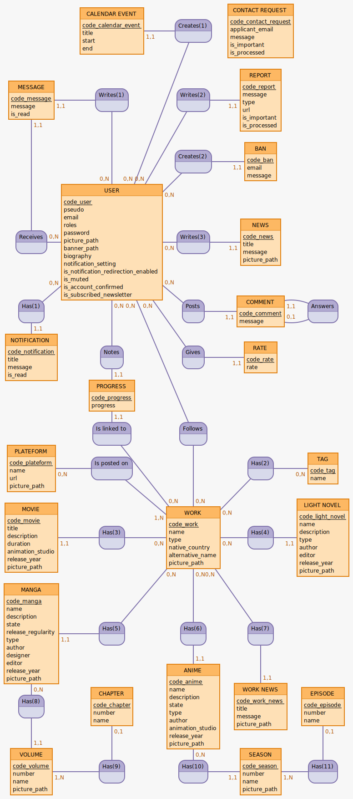
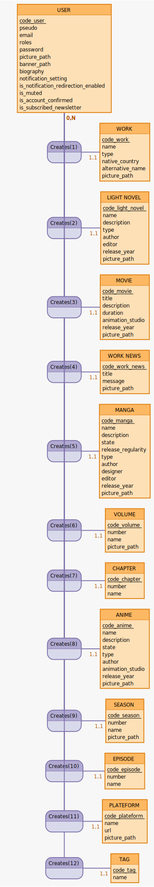

# Modèle Conceptuel de Données

## Base



<details>

    ```mocodo
    CALENDAR EVENT: code_calendar_event, title, start, end
    Creates(1), 11 CALENDAR EVENT, 0N USER
    CONTACT REQUEST: code_contact_request, applicant_email, message, is_important, is_processed

    MESSAGE: code_message, message, is_read
    Writes(1), 11 MESSAGE, 0N USER
    Writes(2), 11 REPORT, 0N USER
    REPORT: code_report, message, type, url, is_important, is_processed

    :
    Creates(2), 11 BAN, 0N USER
    BAN: code_ban, email, message

    Receives, 11 MESSAGE, 0N USER
    USER: code_user, pseudo, email, roles, password, picture_path, banner_path, biography, notification_setting, is_notification_redirection_enabled, is_muted, is_account_confirmed, is_subscribed_newsletter
    Writes(3), 11 NEWS, 0N USER
    NEWS: code_news, title, message, picture_path

    Has(1), 11 NOTIFICATION, 0N USER
    :
    Posts, 11 COMMENT, 0N USER
    COMMENT: code_comment, message
    Answers, 11 COMMENT, 01 COMMENT

    NOTIFICATION: code_notification, title, message, is_read
    Notes, 11 PROGRESS, 0N USER
    Gives, 11 RATE, 0N USER
    RATE: code_rate, rate

    PROGRESS: code_progress, progress
    :

    Is linked to, 0N WORK, 11 PROGRESS
    Follows, 0N WORK, 0N USER

    PLATEFORM: code_plateform, name, url, picture_path
    Is posted on, 1N WORK, 0N PLATEFORM
    :
    Has(2), 0N TAG, 0N WORK
    TAG: code_tag, name

    MOVIE: code_movie, title, description, duration, animation_studio, release_year, picture_path
    Has(3), 11 MOVIE, 0N WORK
    WORK: code_work, name, type, native_country, alternative_name, picture_path
    Has(4), 11 LIGHT NOVEL, 0N WORK
    LIGHT NOVEL: code_light_novel, name, description, type, author, editor, release_year, picture_path

    MANGA: code_manga, name, description, state, release_regularity, type, author, designer, editor, release_year, picture_path
    Has(5), 11 MANGA, 0N WORK
    Has(6), 11 ANIME, 0N WORK
    Has(7), 11 WORK NEWS, 0N WORK

    Has(8), 11 VOLUME, 0N MANGA
    CHAPTER: code_chapter, number, name
    ANIME: code_anime, name, description, state, type, author, animation_studio, release_year, picture_path
    WORK NEWS: code_work_news, title, message, picture_path
    EPISODE: code_episode, number, name

    VOLUME: code_volume, number, name, picture_path
    Has(9), 01 CHAPTER, 1N VOLUME
    Has(10), 11 SEASON, 0N ANIME
    SEASON: code_season, number, name, picture_path
    Has(11), 01 EPISODE, 1N SEASON
    ```

</details>

## Partie création



<details>

    ```mocodo
    USER: code_user, pseudo, email, roles, password, picture_path, banner_path, biography, notification_setting, is_notification_redirection_enabled, is_muted, is_account_confirmed, is_subscribed_newsletter

    :
    Creates(1), 11 WORK, 0N USER
    WORK: code_work, name, type, native_country, alternative_name, picture_path

    :
    Creates(2), 11 LIGHT NOVEL, 0N USER
    LIGHT NOVEL: code_light_novel, name, description, type, author, editor, release_year, picture_path

    :
    Creates(3), 11 MOVIE, 0N USER
    MOVIE: code_movie, title, description, duration, animation_studio, release_year, picture_path

    :
    Creates(4), 11 WORK NEWS, 0N USER
    WORK NEWS: code_work_news, title, message, picture_path

    :
    Creates(5), 11 MANGA, 0N USER
    MANGA: code_manga, name, description, state, release_regularity, type, author, designer, editor, release_year, picture_path

    :
    Creates(6), 11 VOLUME, 0N USER
    VOLUME: code_volume, number, name, picture_path

    :
    Creates(7), 11 CHAPTER, 0N USER
    CHAPTER: code_chapter, number, name

    :
    Creates(8), 11 ANIME, 0N USER
    ANIME: code_anime, name, description, state, type, author, animation_studio, release_year, picture_path

    :
    Creates(9), 11 SEASON, 0N USER
    SEASON: code_season, number, name, picture_path

    :
    Creates(10), 11 EPISODE, 0N USER
    EPISODE: code_episode, number, name

    :
    Creates(11), 11 PLATEFORM, 0N USER
    PLATEFORM: code_plateform, name, url, picture_path

    :
    Creates(12), 11 TAG, 0N USER
    TAG: code_tag, name
    ```

</details>
